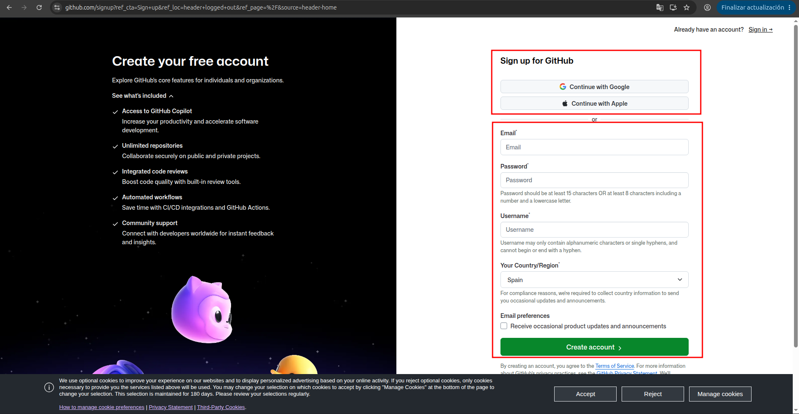
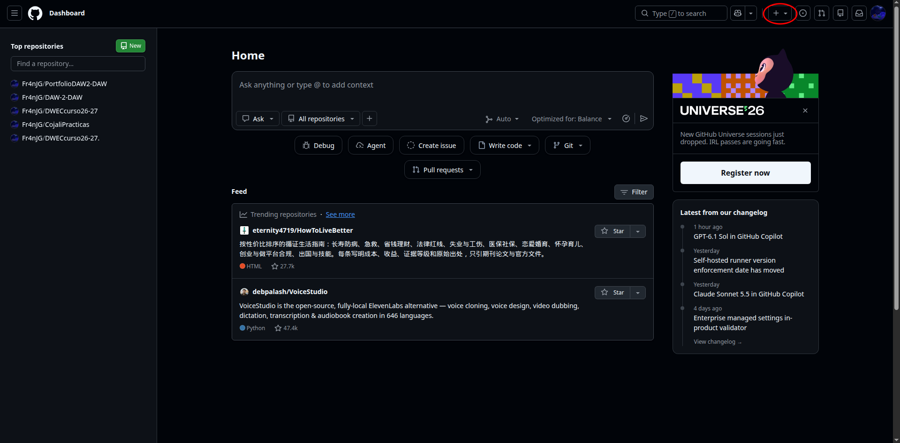
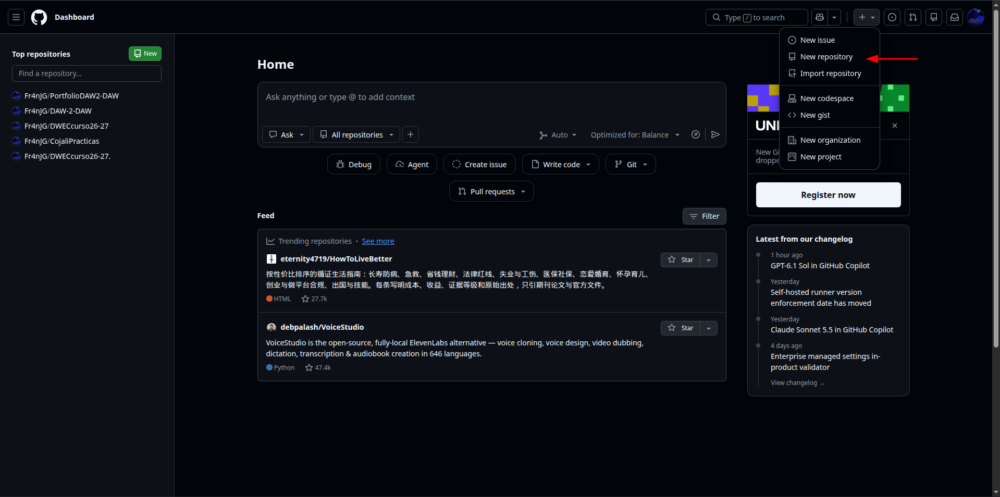
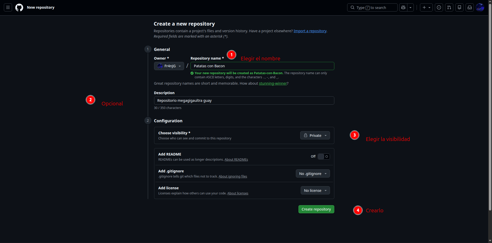
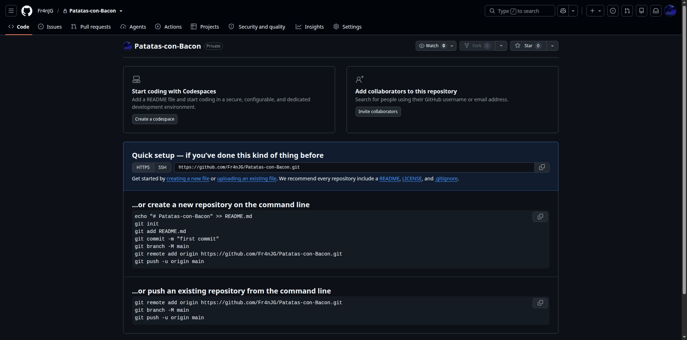
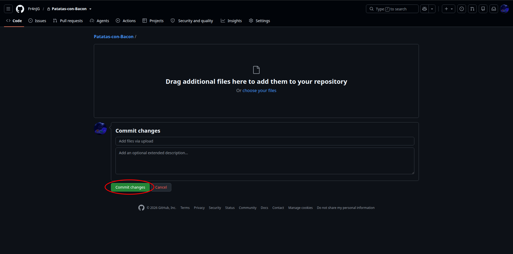
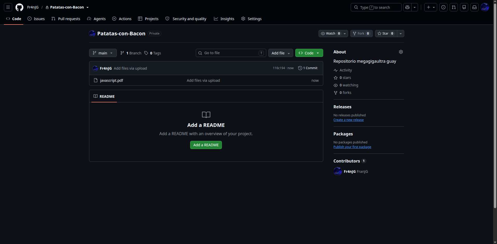

# Como usar github para principiantesTitulo
GitHub es una plataforma de desarrollo basada en la nube que utiliza el sistema de control de versiones Git. Funciona como un ecosistema donde usuarios y comunidades (de código abierto) gestionan proyectos de software desde su creación hasta su despliegue final. Permite guardar el historial de cambios de un proyecto, trabajar en equipo, revisar código y automatizar tareas, todo desde el navegador o desde la línea de comandos.

## Como crear repositorio
Inicia sesión en github.com (o crea una cuenta gratuita).

Pulsa el icono + de la esquina superior derecha y elige New repository.

Escribe un nombre para el repositorio.
Elige la visibilidad: Public o Private.

Pulsa Create repository.

### Como subir archivos
Entra en el repositorio y pulsa *creating a new file or uploading an existing file*
.png)

Selecciona los archivos.
.png)

Pulsa Commit changes.

### Como crear carpetas

## Hacer conclusion

## Bibliografia (si es necesario)

